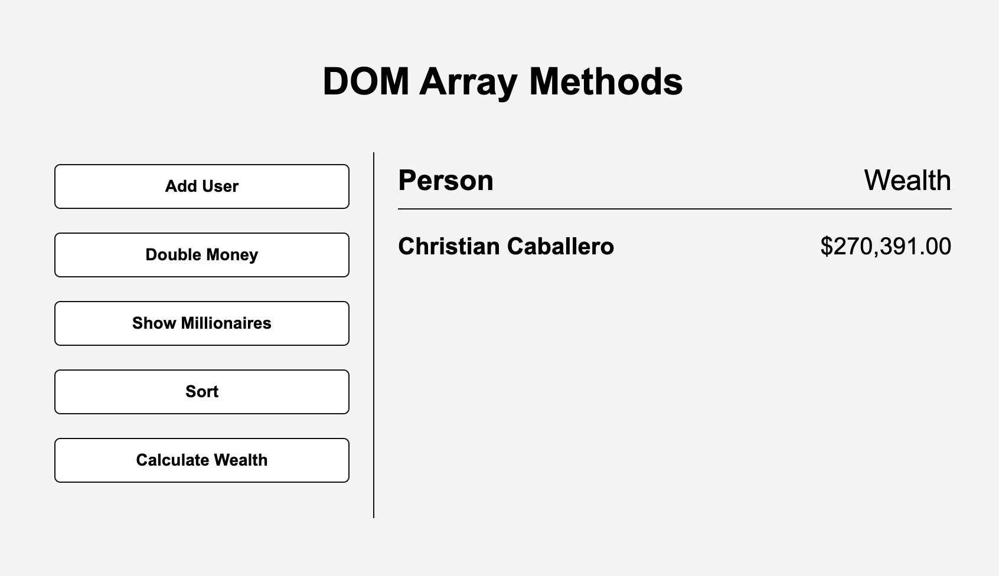

# DOM Array Methods

## Description

This project is a simple project that demonstrates the use of DOM Array Methods. It is a project that filters, maps, sorts through an array of data fetched from Random User API and displays it on the DOM.

---

